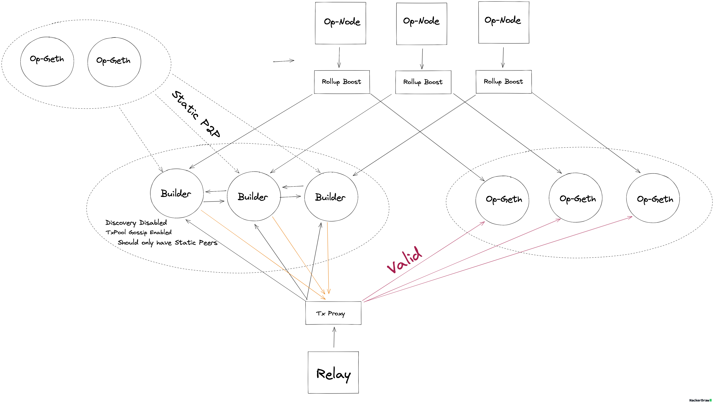

# tx-proxy: World Chain Transaction Relay Service

`tx-proxy` is a supplemental pass through proxy that re-routes RPC traffic to two high availability execution layer backends. 

Priority Blockspace for Human's (PBH) on World Chain introduces an external block builder to the OP Stack which enforces a custom validation policy for PBH transactions. The role of `tx-proxy` is to validate transactions through the block builder prior to forwarding the transactions to the sequencing execution clients on the network. Ensuring synchronization of the mempool's across all sequencing execution clients on the network. 

**Endpoints**
- `eth_sendRawTransaction`
- `eth_sendRawTransactionConditional`

Its primary purpose is to ensure transactions are validated by builders before being relayed to Op-Geth sequencers. 

## License

Unless otherwise specified, all code in this repository is dual-licensed under
either:

- MIT License ([LICENSE-MIT](LICENSE-MIT))
- Apache License, Version 2.0, with LLVM Exceptions
  ([LICENSE-APACHE](LICENSE-APACHE))

at your option. This means you may select the license you prefer to use.

Any contribution intentionally submitted for inclusion in the work by you, as
defined in the Apache-2.0 license, shall be dual licensed as above, without any
additional terms or conditions.

